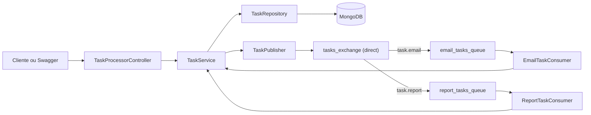
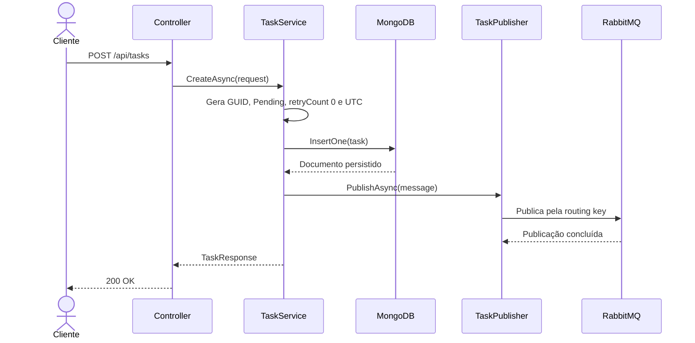
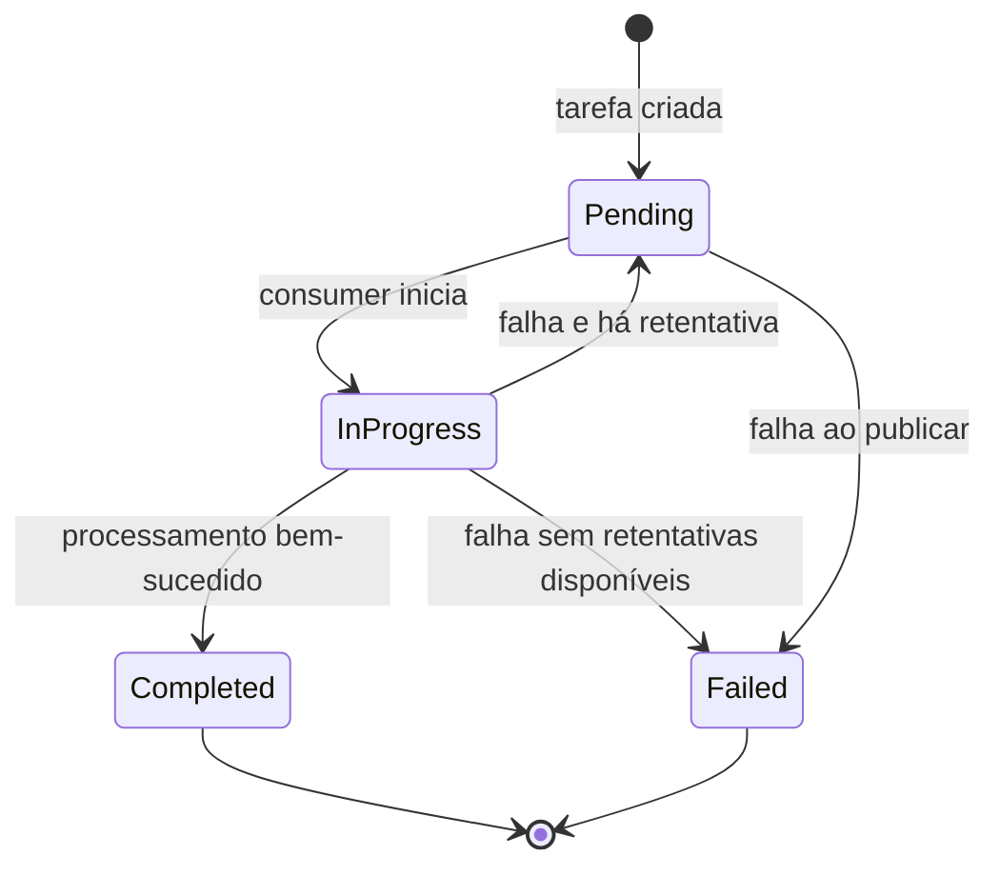
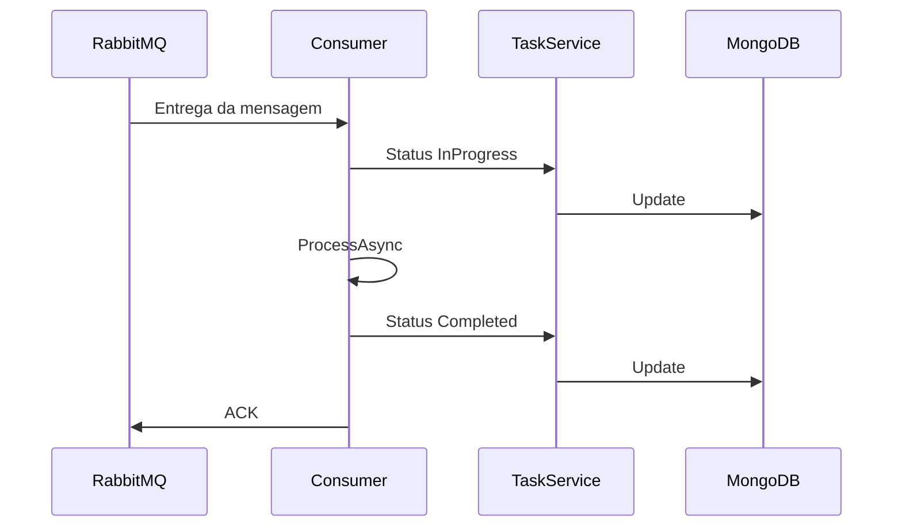

# Documentação técnica e regras de negócio

Este documento descreve em detalhes a implementação do Task Processor, as regras de negócio aplicadas ao ciclo de vida das tarefas e as decisões técnicas adotadas.

Para instruções rápidas de execução, consulte o [README](./README.md).

## 1. Objetivo e escopo

O Task Processor recebe tarefas por uma API HTTP e executa o processamento de forma assíncrona. O projeto separa o recebimento da requisição do processamento efetivo por meio do RabbitMQ.

O processamento de e-mail e relatório é simulado. O objetivo atual não é enviar e-mails ou gerar arquivos reais, mas demonstrar:

- recebimento e validação de tarefas;
- persistência em banco NoSQL;
- publicação e roteamento de mensagens;
- execução por workers em segundo plano;
- controle de status;
- tratamento de falhas e retentativas;
- concorrência e possibilidade de escala horizontal.

## 2. Visão geral da arquitetura

A API e os workers são executados no mesmo processo ASP.NET Core. O RabbitMQ desacopla a criação da tarefa de seu processamento, enquanto o MongoDB funciona como fonte persistente do estado.



### Componentes principais

| Componente | Responsabilidade |
|---|---|
| `TaskProcessorController` | Expor os endpoints HTTP e encaminhar as operações ao serviço |
| `TaskService` | Orquestrar criação, consulta, publicação, status e limite de retentativas |
| `TaskRepository` | Persistir tarefas e executar atualizações no MongoDB |
| `TaskPublisher` | Escolher a routing key e publicar a mensagem no RabbitMQ |
| `RabbitMqConnectionProvider` | Manter e recuperar a conexão compartilhada usada pelo publisher |
| `TaskConsumerBase` | Implementar o comportamento comum dos consumidores |
| `EmailTaskConsumer` | Simular o processamento de uma tarefa de e-mail |
| `ReportTaskConsumer` | Simular o processamento de uma tarefa de relatório |

### Mensagem do RabbitMQ

`ProcessTaskMessage` contém apenas os dados necessários para localizar e processar a tarefa:

| Campo | Finalidade |
|---|---|
| `TaskId` | Relacionar a mensagem ao documento persistido |
| `Type` | Determinar o tipo da tarefa |
| `Data` | Disponibilizar os dados de processamento ao worker |

### Documento do MongoDB

`TaskModel` possui:

| Campo | Descrição |
|---|---|
| `Id` | GUID gerado pela aplicação e armazenado como string |
| `Type` | Tipo da tarefa |
| `Data` | Dados necessários ao processamento |
| `Status` | Estado atual |
| `RetryCount` | Quantidade de retentativas já liberadas |
| `CreatedAt` | Data de criação em UTC |

O banco utilizado é `taskprocessor` e a collection é `tasks`.

## 3. Fluxo de criação



### Ordem escolhida

A tarefa é persistida antes da publicação. Essa ordem garante que o consumer possa encontrar o documento quando receber a mensagem.

Se a publicação lançar uma exceção:

1. a tarefa já persistida é atualizada para `Failed`;
2. a exceção é propagada;
3. a requisição HTTP termina com erro.

## 4. Topologia e publicação no RabbitMQ

### Exchange

| Propriedade | Valor |
|---|---|
| Nome | `tasks_exchange` |
| Tipo | `direct` |
| Durable | `true` |
| Auto delete | `false` |

Uma exchange `direct` encaminha a mensagem somente para bindings cuja routing key corresponde exatamente à routing key da publicação.

### Filas e bindings

| Tipo | Routing key | Fila |
|---|---|---|
| `EnviarEmail` | `task.email` | `email_tasks_queue` |
| `GerarRelatorio` | `task.report` | `report_tasks_queue` |

As filas são:

- duráveis;
- não exclusivas;
- não removidas automaticamente.

O publisher seleciona a routing key com um `switch` baseado no `TaskType`. Um tipo não reconhecido causa `ArgumentException`.

### Durabilidade da mensagem

A publicação utiliza:

```text
Persistent = true
ContentType = application/json
ContentEncoding = utf-8
mandatory = true
```

`Persistent = true`, junto de exchange e fila duráveis, permite que mensagens persistentes sejam recuperadas pelo broker após uma reinicialização normal. Os volumes do Compose preservam os dados do RabbitMQ no host.

### Conexão e canal do publisher

`RabbitMqConnectionProvider`:

- abre a conexão quando o hosted service inicia;
- reutiliza a conexão enquanto ela estiver aberta;
- habilita recuperação automática;
- usa `SemaphoreSlim` para evitar que chamadas concorrentes recriem a conexão simultaneamente;
- encerra e descarta a conexão durante o desligamento da aplicação.

O `TaskPublisher` cria um canal por publicação e o descarta ao terminar. A conexão é o recurso mais caro e permanece compartilhada; o canal possui vida curta e não é compartilhado entre requisições concorrentes.

## 5. Inicialização dos consumers

`TaskConsumerBase` herda de `BackgroundService`. Cada implementação informa:

- nome da fila;
- routing key;
- nome de exibição;
- lógica específica em `ProcessAsync`.

Ao iniciar, cada consumer:

1. abre sua própria conexão com o RabbitMQ;
2. cria um canal;
3. declara a exchange;
4. declara sua fila;
5. cria o binding;
6. configura a qualidade de serviço;
7. registra o callback de recebimento;
8. permanece aguardando mensagens até o encerramento da aplicação.

## 6. Validação da mensagem no consumer

Antes de alterar o MongoDB, o consumer:

1. desserializa o corpo como `ProcessTaskMessage`;
2. rejeita resultado nulo;
3. valida `TaskId`, `Type` e `Data`.

Quando o JSON é inválido ou falta algum campo obrigatório:

```text
NACK
multiple = false
requeue = false
```

A mensagem não volta para a fila.

## 7. Máquina de estados



### Significado dos estados

| Status | Significado |
|---|---|
| `Pending` | Criada e aguardando consumo, ou preparada para nova tentativa |
| `InProgress` | Recebida e em processamento |
| `Completed` | Processada e persistida como concluída |
| `Failed` | Não publicada ou esgotou as retentativas |

O status é atualizado no MongoDB pelo `TaskService`, que delega a operação ao repositório.

## 8. Fluxo de sucesso

Para uma mensagem válida:

1. o status muda para `InProgress`;
2. `ProcessAsync` executa a lógica específica;
3. o status muda para `Completed`;
4. o consumer envia ACK.

O ACK ocorre depois da atualização para `Completed`. Assim, uma mensagem não é removida da fila antes de o estado final ser persistido.



## 9. Fluxo de falha e retentativa

O limite está definido no `TaskService`:

```csharp
private const int MaxRetryCount = 3;
```

Na falha do processamento:

1. o consumer solicita `TryPrepareTaskForRetryAsync`;
2. o repositório tenta incrementar o contador;
3. se o incremento ocorrer, o status volta para `Pending`;
4. o consumer envia NACK com `requeue: true`;
5. o RabbitMQ recoloca a mesma mensagem na fila;
6. se o limite já tiver sido atingido, o status muda para `Failed`;
7. o consumer envia ACK para remover definitivamente a mensagem.

O limite representa até 3 retentativas além da tentativa inicial. Portanto, uma tarefa pode ser processada no máximo 4 vezes:

```text
Tentativa inicial + retentativa 1 + retentativa 2 + retentativa 3
```

### Atualização atômica no MongoDB

O repositório utiliza uma única operação `FindOneAndUpdate` com:

- filtro por `TaskId`;
- condição `RetryCount < MaxRetryCount`;
- incremento `$inc` de `RetryCount`;
- alteração de `Status` para `Pending`;
- retorno do documento após a atualização.

Conceitualmente:

```text
SE Id == taskId E RetryCount < 3
ENTÃO RetryCount += 1 E Status = Pending
RETORNE o documento atualizado
```

O teste da condição e o incremento acontecem no servidor MongoDB como uma única operação. Dois workers não conseguem ler o mesmo valor antigo e salvar o mesmo incremento separadamente.

Se nenhum documento satisfizer o filtro, o repositório retorna `null`. Para o consumer, isso significa que não há uma nova retentativa disponível.

## 10. ACK e NACK

| Situação | Confirmação | Requeue | Resultado |
|---|---|---:|---|
| Processamento concluído | ACK | - | Remove a mensagem |
| Falha com retentativa disponível | NACK | `true` | Devolve a mensagem à fila |
| Falha após o limite | ACK | - | Remove a mensagem definitivamente |
| JSON ou campos inválidos | NACK | `false` | Descarta a mensagem |

## 11. Processamento simulado

### E-mail

`EmailTaskConsumer`:

- aguarda 5 segundos;
- sorteia um número entre 1 e 10;
- falha quando o resultado é 1;
- possui aproximadamente 10% de probabilidade de falha por tentativa.

### Relatório

`ReportTaskConsumer`:

- aguarda 15 segundos;
- sorteia um número entre 1 e 10;
- falha quando o resultado é 1, 2 ou 3;
- possui aproximadamente 30% de probabilidade de falha por tentativa.

Os atrasos simulam operações externas mais demoradas. As exceções simuladas exercitam o fluxo de retentativa.

## 12. Concorrência

Cada instância da aplicação inicia:

- um consumer da fila de e-mail;
- um consumer da fila de relatório.

Como são filas e hosted services distintos, uma tarefa de e-mail e uma tarefa de relatório podem ser processadas ao mesmo tempo.

Cada canal configura:

```text
prefetchCount = 1
global = false
```

Isso limita cada consumer a uma mensagem não confirmada por vez. Consequentemente:

- cada fila é processada sequencialmente por consumer;
- tipos diferentes podem executar em paralelo;
- novas instâncias aumentam a quantidade de consumers por fila;
- o RabbitMQ distribui as mensagens entre consumers concorrentes da mesma fila.

## 13. Configuração e Docker

### Variáveis da API

| Variável | Uso no contêiner |
|---|---|
| `MONGODB_URI` | Endereço do MongoDB |
| `RABBITMQ_HOST` | Host do RabbitMQ |
| `RABBITMQ_PORT` | Porta AMQP |
| `RABBITMQ_USER` | Usuário do broker |
| `RABBITMQ_PASSWORD` | Senha do broker |
| `RABBITMQ_QUEUE` | Atualmente carregada, mas o roteamento usa as filas constantes por tipo |

Dentro da rede do Compose:

```text
API -> mongodb:27017
API -> rabbitmq:5672
```

## 14. Testes

### Testes unitários atuais

Os testes xUnit cobrem a validação de `CreateTaskRequest`:

- requisição válida;
- tipo ausente;
- tipo fora do enum;
- `data` vazia;
- `data` formada somente por espaços;
- `data` nula.

Eles são separados do projeto principal pelo arquivo `TaskProcessor.UnitTests.csproj`.

### Teste de carga

O Locust alterna aleatoriamente entre `EnviarEmail` e `GerarRelatorio`, cria um conteúdo único e envia `POST /api/tasks`.

O script considera sucesso as respostas:

- `200 OK`;
- `201 Created`;
- `202 Accepted`.

Atualmente o `StopUser` encerra cada usuário virtual depois de uma requisição.
